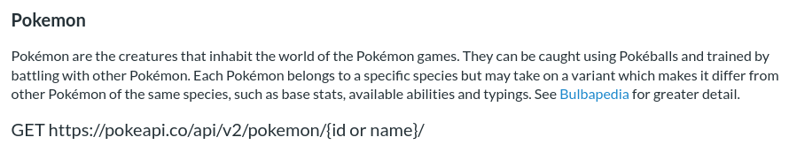
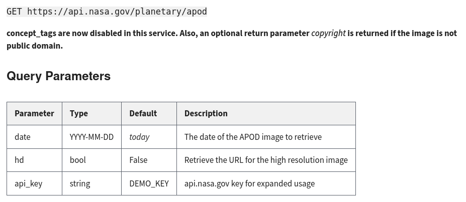
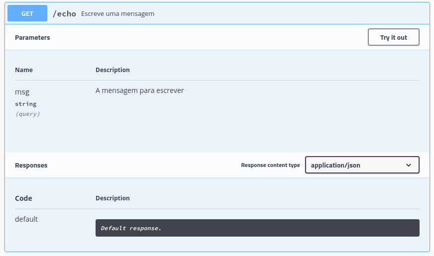

```{r, include=FALSE, warning=FALSE, message=FALSE}
options(htmltools.dir.version = FALSE)
knitr::opts_chunk$set(comment = "#>", echo=TRUE, fig.align='center')
```

# Na aula de hoje

- O que é uma API

- O pacote `{plumber}`

- O que é uma máquina virtual

- O que é docker

- Como empacotar um shiny

- Como automatizar o deploy de um dashboard

---
# Está tudo instalado?

---
# O que significa "deploy"?

> Implantação de software são todas as atividades que tornam um sistema
disponível para uso

- No geral, colocar um software em produção envolve uma série de passos e
técnicas simples e complexos

  - Tirar o código do seu computador e colocá-lo em um **servidor**
  
  - Permitir que o software seja **atualizado** sempre que necessário
  
  - Garantir a **estabilidade** do serviço levando em conta a quantidade de usuários
  
  - **Disponibilizar** o software de forma útil para o usuário final
  
  - Não perder a cabeça no caminho...

---
# Exemplos de implantação

- Disponibilizar uma API

  - **Produto**: código que realiza uma tarefa específica dada uma entrada
  
  - **Objetivo**: permitir que um usuário faça uma chamada para o software e
  receba a resposta desejada
  
  - **Implantação**: servir a API em uma máquina remota

- Transformar um dashboard em um site:

  - **Produto**: código que, quando executado, exibe um dashboard interativo
  
  - **Objetivo**: ter um endereço fixo que, quando acessado, exibe o dashboard
  
  - **Implantação**: servir o dashboard em uma máquina remota

---
# O que é uma API?

> _Application Programming Interface_ (API) é uma interface de computação que
define interações entre múltiplos softwares intermediários

- Essencialmente uma API é uma forma de um computador falar com outro sem
precisar de um humano

- Uma API define:

  - As **chamadas e requisições** que podem ser feitas (e como fazê-las)
  
  - Os **formatos** de dados que podem ser utilizados
  
  - As **convenções** a serem seguidas

- Hoje falaremos especificamente de APIs REST em HTTP, ou seja, **APIs para
serviços web**

---
# Exemplo de API

- Um exemplo de API **sem autenticação** é a PokéAPI: https://pokeapi.co/docs/v2

- A **documentação** é provavelmente o melhor lugar para entender uma API:

```{r, echo=FALSE, fig.align='center'}

```

- Uma API não deixa de ser um "link" que aceita parâmetros e retorna dados

  - Qual a diferença entre um site e uma API?

---
# PokéAPI

- Este **endpoint** recebe o nome de um Pokémon e retorna uma lista de dados

```{r}
library(httr)

resposta <- GET("https://pokeapi.co/api/v2/pokemon/ditto")
resposta

content(resposta)$moves[[1]]$move$name
```

---
# Exemplo de API com autenticação

```{r, echo=FALSE}
NASA_KEY <- Sys.getenv("NASA_KEY")
```

- exemplos de APIs **com autenticação** são as da NASA: https://api.nasa.gov/

- APIs podem receber parâmetros que alteram o seu comportamento (p.e. chave)

```{r, echo=FALSE, fig.align='center', dpi=115}

```

---
# APOD API

- Este **endpoint** retorna a "foto astronômica do dia" para uma certa data

```{r}
params <- list(
  date = "2019-12-31",
  api_key = NASA_KEY # Guardada no meu computaodr
)

resp <- GET("https://api.nasa.gov/planetary/apod", query = params)
content(resp)$url
```

- Neste caso, ainda podemos utilizar a resposta da API para exibir uma imagem

  - Poderíamos, por exemplo, implementar um **site que consulta** essa API

---
background-image: url(https://apod.nasa.gov/apod/image/1912/M33-HaLRGB-RayLiao1024.jpg)
background-size: cover

---
# O pacote {plumber}

> Um pacote R que converte o seu código R pré-existente em uma API web usando
uma coleção de comentários especiais de uma linha

- Qualquer função que recebe uma entrada bem definida e retorna uma saída
estruturada pode se tornar uma API

- Casos de uso:

  - Retornar entradas de uma **tabela**
  
  - Aplicar um **modelo** (vide https://decryptr.netlify.app/)
  
  - Inicializar um **processo externo**
  
  - Muito mais...

---
# Exemplo de {plumber}

- Para criar uma **API local** com o `{plumber}`, basta comentar informações
sobre o endpoint usando `#*`

```{r, eval=FALSE}
library(plumber)

#* Escreve uma mensagem
#* @param msg A mensagem para escrever
#* @get /echo
function(msg = "") {
  paste0("A mensagem é: '", msg, "'")
}
```

- A função precisa estar salva em um arquivo para que possamos invocar os poderes
do `{plumber}` no mesmo

---
# Invocando a API

- Para implantar a API **localmente**, basta rodar os dois comandos a seguir

```{r, eval=FALSE}
api <- plumb("arqs/exemplo_api.R")
api$run(port = 8000)
```

- A função `run()` inicializa a API em http://localhost:8000 (dependendo da
**porta** escolhida)

```{r, eval=FALSE}
params <- list(msg = "Funciona!")
resp <- GET("http://localhost:8000/echo", query = params)

content(resp)[[1]]
```

`#> [1] "A mensagem é: 'Funciona!'"`

---
# Swagger

- Swagger é essencialmente uma API que ajuda a criar APIs, incluindo uma
interface com **documentação** em http://localhost:8000/__swagger__/

```{r, echo=FALSE, fig.align='center', dpi=130}

```

---
# Uma nota sobre REST

> _Representational State Transfer_ (REST) é um estilo de arquitetura de
software que define um conjunto de restrições a serem utilizadas para criar um
serviço web

- O _Hypertext Transfer Protocol_ (HTTP) é a base para toda a **Web**
(≠ Internet)

  - Ele define uma série de **métodos de requisição** para que um computador
  seja capaz de "pegar" e "mandar" conteúdo da/para a Internet
  
  - `GET` pega, `POST` envia e assim por diante

- REST usa os comandos HTTP para definir as mesmas operações, mas **sem estado**

  - Um site requer uma interação permanente com o usuário, enquanto uma API
  realiza **operações instantâneas**

---
# Exemplo de POST

- Um **endpoint** POST normalmente recebe dados, esse é um exemplo simples

```{r, eval=FALSE}
#* Retorna a soma de dois números
#* @param a O primeiro número
#* @param b O segundo número
#* @post /sum
function(a, b) {
  as.numeric(a) + as.numeric(b)
}
```

```{r, eval=FALSE}
params <- list(a = 2, b = 4)
resp <- POST("http://localhost:8000/sum", body = params, encode = "json")

content(resp)[[1]]
```

`#> [1] 6`

---
# O que é Docker?

> Docker é uma _platform as a service_ (PaaS) que usa virtualização de sistemas
operacionais para implantar softwares em "contêineres"

- O Docker não passa de um programa que roda no seu computador e permite
criar e usar **contêineres**

- Contêineres são máquinas virtuais (mais sobre isso a seguir) "superficiais",
acessíveis somente pela linha de comando

- Contêineres são **isolados** entre si e empacotam seu próprio **software**,
bibliotecas e configuração

- Contêineres são construídos em cima de **imagens**, modelos que descrevem os
componentes da máquina virtual

- Para testar, acesse https://labs.play-with-docker.com/

---
# O que é uma máquina virtual?

> Máquina virtual (VM) é um software que provém a funcionalidade de um
computador físico, mas apenas através de emulação

- Normalmente uma máquina virtual emula um **sistema operacional** completo,
desde um monitor até entradas USB

- Um hipervisor usa software nativo para simular **hardware virtual**,
permitindo que código seja executado sem saber que está em uma VM

- Com uma VM é possível "criar" um computador Ubuntu dentro de um Windows e
vice-versa, por exemplo

- Diferentemente de um contêiner, VMs são pesadas e "profundas", dependendo de
uma imagem (ISO) para instalar o sistema operacional

---
# Docker vs. VM

- Note as vantagens e desvantagens de cada arquitetura

```{r, echo=FALSE, fig.align='center', dpi=130}
knitr::include_graphics("static/dockervm.png")
```

---
# Dockerfile

- Grande parte das imagens Docker já estão disponíveis no **Docker Hub** (como
um CRAN do Docker)

  - Inclusive, lá estão várias imagens específicas para R, incluíndo RStudio
  Server, Shiny, etc. https://hub.docker.com/u/rocker

- Podemos criar uma imagem nova com um **Dockerfile**, um arquivo que especifica
como ela deve ser construída

  - O primeiro componente é sempre a **imagem base** (muitas vezes um sistema
  operacional)
  
  - A seguir vêm os comandos de **configuração**
  
  - Por fim, o **comando** a ser executado pelo contêiner

---
# Exemplo de Dockerfile

- A base já foi feita pelo autor do `{plumber}` e tem tudo que precisamos

- Copiamos o arquivo para **dentro do contêiner** de modo a utilizá-lo

- **Expor a porta** 8000 é necessário porque ela é onde a API será servida

- O **comando** de execução deve ser o caminho para o arquivo fonte da API (isso
está descrito na documentação)

```{}
FROM trestletech/plumber

COPY exemplo_api.R /

EXPOSE 8000
CMD ["/exemplo_api.R"]
```

---
# Exemplo de imagem e contêiner

- Para criar a imagem, é necessário estar dentro do diretório do Dockerfile

- O comando `docker build` monta uma imagem a partir do Dockerfile e seus
arquivos associados e dá um nome para a mesma (argumento `-t`)

- O comando `docker run` executa uma imagem, criando um contêiner

  - O argumento `-p` indica a porta a ser servida no hospedeiro e a porta
  original
  
  - O argumento `--rm` limpa o armazenamento depois que tudo acaba

```{}
cd arqs/exemplo_api/

docker build -t exemplo .

docker run -p 8000:8000 --rm exemplo
```

---
# Shiny empacotado

---
# O pacote {golem}

---
# Google Cloud

---
# Compute Engine

---
# Firewall

---
# IP estático
